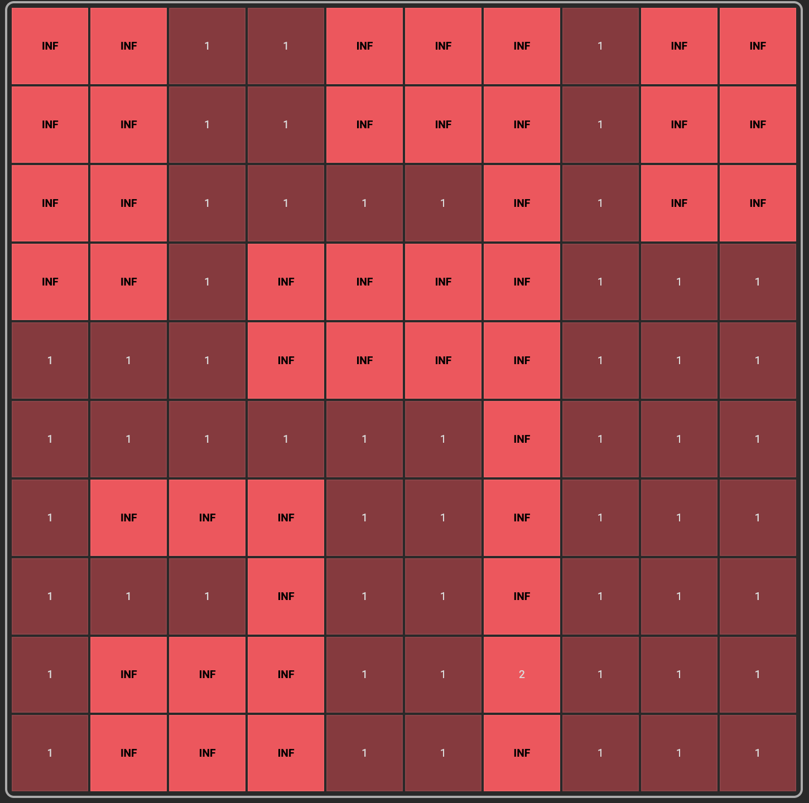
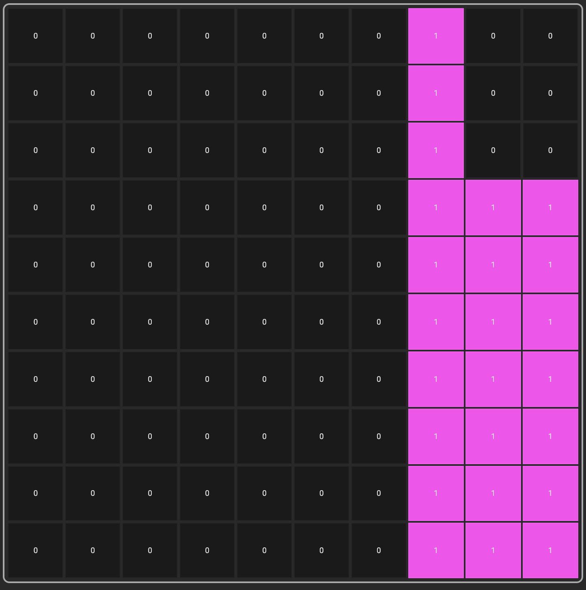
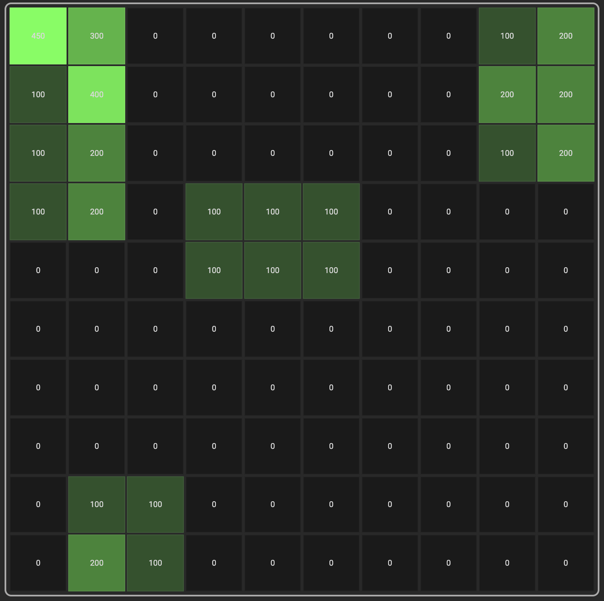
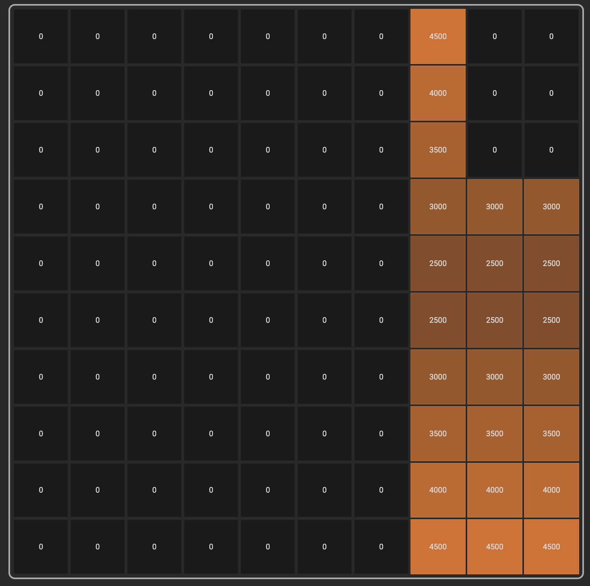

# EVCSP-Map-Creator
EVCSP frontend. This part of the application was written, using: React, Typescript and Vite.
The main purpose is to write custom maps required, by optimization part of the project, with the
custom user-friendly map-creation interface.

## Commands
```bash
# install dependencies
npm install

# build command
npm run build

# start command
npm run dev
```

## Maps

### Distances Map
Represents obstacles and costs from travelling from
given node to another.



### Point Of Intrest (POI) Map
Represents the locations, where we possibly can build
our electric vehicle charging stations.



### Demand Map
Represents energy consumption demand of electric vehicle users,
at a given piece of terrain.



### Land Rental Cost Map
Represents rental cost of specific point of intreset on the map.




## Tech Stack
<p align="center">
  <a href="https://skillicons.dev">
    
  </a>
</p>
 